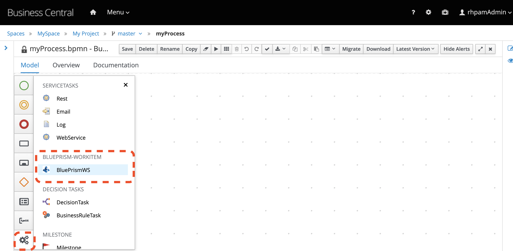
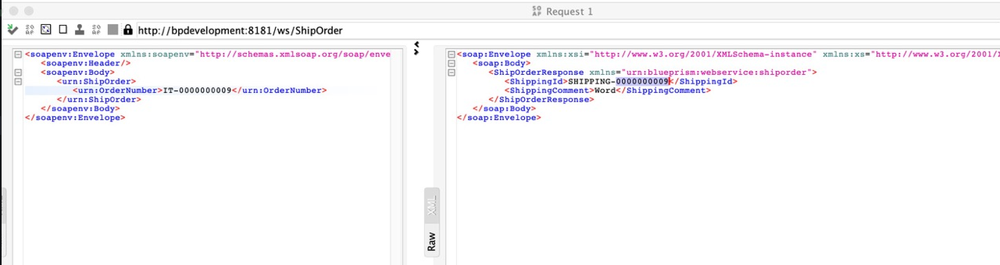

# BluePrism Work Item Handler

This custom task enables integrating RHPAM (a.k.a jBPM) with BluePrism RPA. With it, users can automate human tasks by invoking a Digital Workforce (BluePrism Processes or Objects) within processes or cases created in RHPAM.

## How to Use

A detailed guide can be found at [Integrating Red Hat Process Automation Manager with BluePrism Digital Workforce]("https://kmacedovarela.github.io/blueprism/guide/guide.html").

## About this BluePrism Task

This scenario considers that the BluePrism task used inside a RHPAM process consumes, via HTTP, the SOAP Web Services exposed by BluePrism.

This BluePrism Task is a custom work item handler (WIH). To know more about how to create a custom WIH, check [this great post from Maciej Swiderski.](http://mswiderski.blogspot.com/2018/04/jbpm-work-items-are-really-simple.html).

This WIH is an extension of this [jBPM Web Service Task](https://github.com/kiegroup/jbpm/blob/master/jbpm-workitems/jbpm-workitems-webservice/src/main/java/org/jbpm/process/workitem/webservice/WebServiceWorkItemHandler.java).

### Why extend the existing WS Task  

When exchanging data via HTTP with a SOAP Web Service, services can send/receive:
- simple types i.e., `String` and `Integer`, or
- complex types i.e., POJOs like Person or Order.

The [Web Service Task](https://github.com/kiegroup/jbpm/blob/master/jbpm-workitems/jbpm-workitems-webservice/src/main/java/org/jbpm/process/workitem/webservice/WebServiceWorkItemHandler.java) uses CXF under the covers, and it works as expected when sending or receiving simple typed objects. Although, when working with complex java objects, we noticed unexpected `ClassCastException` errors due to improper marshaling and unmarshalling of the request and/or response.

To ilustrate the scenario that lead to the creation of this custom task, look at this example of a HTTP SOAP request. The request contains an object that contains only one attribute, a simple type object (`String`) and the response contains a wrapper, a complex type, (`ShipOrderResponse`) with two attributes:

When using the WS Task, this scenario results in error. The CXF DynamicClient will try to [convert the response to a list](https://github.com/apache/cxf/blob/ab3df13b8d15aa36365eb2e10b5961d17330d9a2/core/src/main/java/org/apache/cxf/endpoint/ClientImpl.java#L646). Although, when we look at the WS Task [`executeWorkItem()` method](https://github.com/kiegroup/jbpm/blob/03a55287e1fb297a16d8986364086ba2dc6fd6da/jbpm-workitems/jbpm-workitems-webservice/src/main/java/org/jbpm/process/workitem/webservice/WebServiceWorkItemHandler.java#L392), we see that only one object is considered on the response.

To overcome this challenge, this task extends the existing task to take advantadge of the current implementation and add one extra feature: support to sending and receiving POJO's.

To achieve this goal, this custom task overwrites one method: `getWSClient()`. On this method, it identifies the exact interceptor which tries to unmarshall the object, and change the configuration `unwrappedOperation` so it won't unmarshall it. Notice that it only changes the configuration of the respective `Operation` informed for the BluePrism task interaction.
